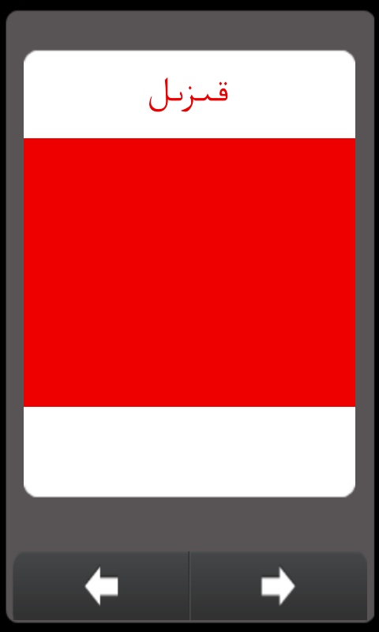

Colors
======

Color for Kids. Android app.

This app helps kids to recognize colors and remember color names.

بالىلارئۈچۈن تۈزۈلگەن كۆپ ئۇچرايدىغان رەڭلەرنى، رەڭنىڭ نامى، ئوقۇلىشى قاتارلىقلارنى تۇنۇشغا ياردەم بىرىدىغان ئەپ.

Screenshots
---------

Download Link
---------
* [Download from Bilkan Bazar](http://bazar.bilkan.net/App.aspx?id=53)

Similar Projects
---------
* [Four Operators](https://github.com/Bilkan/FourOperators)
* [Shapes](https://github.com/Bilkan/Shapes)
* [Plants](https://github.com/Bilkan/Plants)
* [Numbers](https://github.com/Bilkan/Numbers)
* [Compare](https://github.com/Bilkan/Compare)
